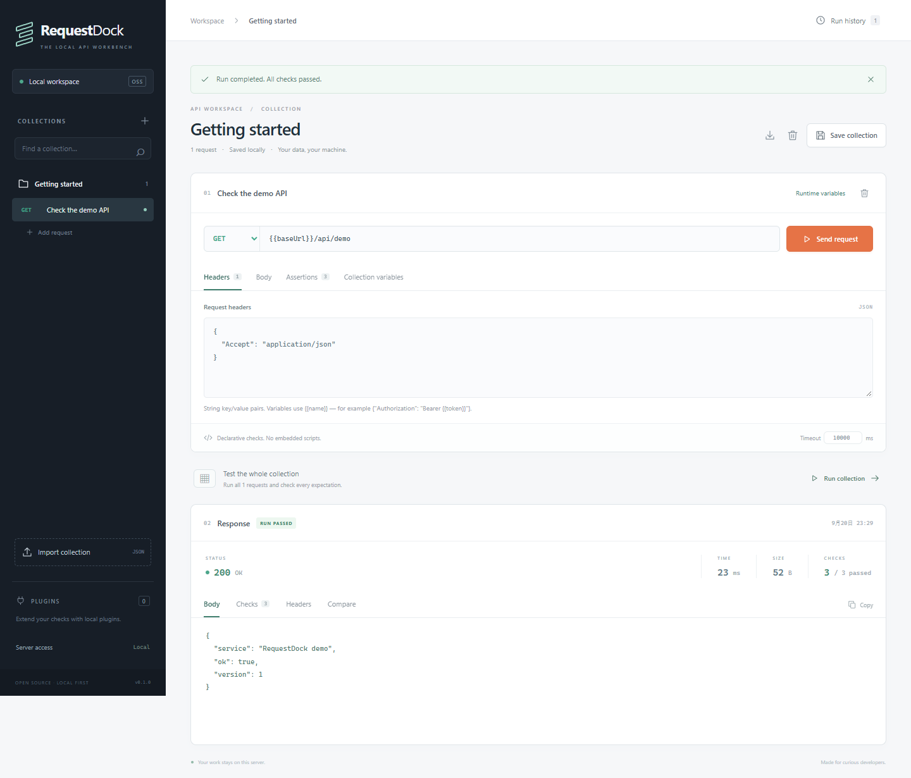

# RequestDock

[](https://github.com/cocode199/requestdock/actions/workflows/ci.yml)

**Send an HTTP request. Check the response. Compare the next run.**

RequestDock is a local API workbench built with TypeScript, React, and Node.js. Keep collections as JSON, use the browser to debug requests, and run the same declarative checks from the CLI. No account is required.

[简体中文](README.zh-CN.md) · [Quick start](#quick-start) · [CLI](#cli) · [Contributing](CONTRIBUTING.md) · [Roadmap](ROADMAP.md)



## Why RequestDock?

After a backend change, a successful HTTP response can still contain the wrong data. RequestDock puts request editing, explicit checks, and saved response comparisons in one small workflow:

1. Send a request to your local or test API.
2. Check its status, JSON fields, headers, or response time.
3. Save a run and compare the next run, ignoring fields that intentionally change.
4. Run the same collection from a terminal or your own CI job.

This is an **early 0.1 MVP for one user and small collections**. It implements a subset of Postman's HTTP debugging and regression workflows. It is not a drop-in replacement for Postman, a team collaboration platform, or an audited production service. Bruno and Hoppscotch are established alternatives; local files, a CLI, and account-free use are not unique to this project. Our proposed focus is the simple combination of declarative checks and response comparisons; its usefulness still needs validation with real users. See the [candidate research](docs/RESEARCH.md) (Chinese).

The source is public at [cocode199/requestdock](https://github.com/cocode199/requestdock). The npm package has **not** been published. `package.json` remains `private: true`; the commands below run from source.

## Quick start

Requirements: **Node.js 22.12 or later** (24 recommended), npm, and Git. These commands work in **PowerShell on Windows** and **POSIX shells on macOS/Linux**:

```sh
git clone https://github.com/cocode199/requestdock.git
cd requestdock
npm ci
npm run build
npm start -- --port 4310
```

You can also use GitHub's **Code → Download ZIP**, extract it, and run the npm commands from the extracted directory.

Open [http://127.0.0.1:4310](http://127.0.0.1:4310). Select the built-in demo request and click **Send request**. It uses a synthetic API served by RequestDock itself, so you do not need an API key or an external service. A successful run returns status `200` and passing checks. Use **Save collection** to keep an edited collection in your local workspace.

Keep the server running. In a second terminal, in the repository directory:

```sh
npm run cli -- run examples/collection.json --output baseline.local.json
npm run cli -- run examples/collection.json --output current.local.json
npm run cli -- compare baseline.local.json current.local.json
```

Expected: both runs report `1/1 requests passed`; the comparison reports `"equal": true` and exits with code `0`. The `.local.json` filenames are ignored by Git. Output files are not overwritten unless you explicitly pass `--force` to `run`.

Create your own collection with `npm run cli -- init collection.local.json`. If port 4310 is busy, start on another port and override the sample's `baseUrl`, for example `npm run cli -- run examples/collection.json --env baseUrl=http://127.0.0.1:4311`.

## Included in the MVP

| Capability | Current scope |
| --- | --- |
| HTTP requests | Methods, URL, headers, text body, timeouts, and `{{variables}}` |
| Checks | Status, JSON value/structure equality, exact header values, response time |
| Web workbench | Request editor, collection CRUD, run results, import/export, and local history |
| Response comparisons | Match requests by ID; compare status, errors, and JSON/text bodies; ignore selected JSON paths |
| CLI | Initialize, run, compare, import, and serve; JSON reports and meaningful exit codes |
| Imports | Native RequestDock JSON and basic Postman Collection v2.1 imports with warnings |
| Plugins | Explicitly loaded, trusted local `.mjs` assertion modules |
| Deployment | Source build, Dockerfile, Compose, and CI configuration |

There is no team account system, RBAC, cloud sync, OAuth flow manager, Postman JavaScript script execution, multipart/file uploads, WebSocket/gRPC support, or load testing. Imports are **not lossless**: inspect warnings for authentication, scripts, and unsupported fields before running a migrated collection.

Requests run sequentially, with at most 100 requests per collection and 100 assertions per request. Default timeout is 10 seconds, maximum 60 seconds; request bodies are limited to 1 MiB and responses to 2 MiB. A run has a 16 MiB serialized report budget: if the next result exceeds the budget, its response content is omitted, the run explicitly fails, and remaining requests are marked as not sent. Redirects are returned as their original 3xx response and are not followed.

Web history keeps the newest runs within **both 20 reports and 64 MiB of stored report files**. Older runs are removed when either limit is reached; export important baselines separately. These are data-size budgets, not a fixed process-memory ceiling. The HTTP API also has a 4 MiB JSON input limit; use the CLI for comparing large report files.

## Collection format

```json
{
  "version": 1,
  "name": "Local smoke checks",
  "variables": { "baseUrl": "http://127.0.0.1:4310" },
  "requests": [
    {
      "id": "demo",
      "name": "Demo endpoint",
      "method": "GET",
      "url": "{{baseUrl}}/api/demo",
      "headers": {},
      "timeoutMs": 5000,
      "assertions": [
        { "type": "status", "expected": 200 },
        { "type": "json", "path": "$.ok", "expected": true }
      ]
    }
  ]
}
```

This is RequestDock's format. The [shared types](src/shared/types.ts) and [schema](src/core/schema.ts) define it. JSON checks compare values by type and structure. Header names are case-insensitive, while expected header values must match exactly. Time checks include fetching and reading the response, excluding plugin execution.

Variable precedence is collection `variables` → `--env-file` → `--env`. Environment files are JSON objects with string values. Web runtime variables also override collection values without being saved into the collection. Substitution works in URLs, header values, and bodies; values are not automatically URL-encoded. An undefined variable fails the request.

## CLI

```sh
# Override the target without changing the collection
npm run cli -- run examples/collection.json --env baseUrl=http://127.0.0.1:4310

# Inject variables from a local JSON file that you create
npm run cli -- run collection.local.json --env-file local.env.json

# Emit a machine-readable report; --silent suppresses npm's lifecycle text
npm run --silent cli -- run examples/collection.json --json --output run.local.json

# Ignore dynamic response fields; --ignore can be repeated
npm run cli -- compare baseline.local.json current.local.json --ignore timestamp --ignore meta.generatedAt

# Import an existing Postman v2.1 or RequestDock JSON file
npm run cli -- import postman.json --output imported.local.json

# Load a trusted local assertion plugin
npm run cli -- run collection.local.json --plugin ./examples/plugins/required-keys.mjs

# Choose the workspace directory
npm run cli -- serve --host 127.0.0.1 --port 4310 --data .requestdock
```

Plugin loading alone does not add a check. Reference the plugin in a request's assertions, for example `{ "type": "plugin", "plugin": "required-keys", "options": { "keys": ["ok"] } }`. See [the example module](examples/plugins/required-keys.mjs) and [plugin guide](docs/PLUGINS.md) (Chinese).

| Exit code | Meaning |
| --- | --- |
| `0` | Command succeeded; checks passed or compared runs are equal |
| `1` | Request/check failure or differences between runs |
| `2` | Invalid input, file, configuration, or startup error |

HTTP 4xx/5xx responses do not automatically fail a run without a matching assertion. Add explicit status checks for your intended behavior. `init`, `run`, and `import` support `--force` to overwrite their output file. Use `npm run cli -- --help` or a subcommand's `--help` for all options.

Comparisons match stable request `id` values and inspect status, request errors, and response bodies. They exclude run timestamps, durations, headers, and check messages. Ignore paths are relative to each JSON body, such as `timestamp`, `$.meta.generatedAt`, or `items[0].id`; wildcards are unsupported. Non-JSON bodies are compared as text.

## Local data and security

Collections and web history live in `.requestdock` by default. The service is designed for a single trusted user and binds to `127.0.0.1`. Binding outside loopback requires a `REQUESTDOCK_TOKEN` of at least 24 characters; remote access also needs a trusted network and TLS. Anyone with access can use the server's network access, including reachable internal APIs.

Running collections sends real requests: review targets and methods before running imported collections. Variables are stored in plaintext. Responses and reports can contain sensitive data, and name-based redaction cannot identify every secret. Trusted local plugins run with the Node.js process's full permissions and are **not sandboxed**. Read the [security policy](SECURITY.md) before remote use or sharing data.

[Docker, backup, and deployment instructions](docs/DEPLOYMENT.md) are currently in Chinese. A minimal local Compose start is:

PowerShell:

```powershell
$env:REQUESTDOCK_TOKEN = node -e "process.stdout.write(require('node:crypto').randomBytes(32).toString('hex'))"
docker compose up --build -d
```

POSIX shell:

```sh
export REQUESTDOCK_TOKEN="$(node -e "process.stdout.write(require('node:crypto').randomBytes(32).toString('hex'))")"
docker compose up --build -d
```

Open the local URL above and enter that token in the UI. Keep the token available securely for later Compose commands. Compose binds only the host's loopback interface and stores data in a named volume. Avoid `docker compose down -v` unless you intend to delete that data.

## Develop and contribute

```sh
npm ci
npm run check
npx playwright install chromium
npm run test:e2e
```

`check` runs TypeScript checks, unit/integration tests, and the production build. For development, run `npm run dev` for the backend and `npm run dev:ui` in another terminal for Vite. Tests use local fixture APIs instead of relying on public API availability.

Start with [CONTRIBUTING.md](CONTRIBUTING.md): it contains reproducible starter tasks and acceptance criteria. Documentation, translations, minimal bug reproductions, and accessibility improvements are useful contributions. Use [Discussions](https://github.com/cocode199/requestdock/discussions) for usage questions and [Issues](https://github.com/cocode199/requestdock/issues) for reproducible problems. See the [Code of Conduct](CODE_OF_CONDUCT.md), [roadmap](ROADMAP.md), and [changelog](CHANGELOG.md). No purchased stars, fake usage claims, or bulk low-value submissions.

CI configuration is in [ci.yml](.github/workflows/ci.yml). Dated local results and unverified items are recorded in [VALIDATION.md](docs/VALIDATION.md) (Chinese); configured checks are not a claim that every environment has passed.

Packaging changes should also pass `npm run test:package`, which builds and installs a real package archive in an isolated temporary directory. This check does not publish a package to npm.

## Further documentation

The following detailed guides are currently in Chinese; English documentation contributions are welcome.

- [HTTP API reference](docs/API.md)
- [Architecture and constraints](docs/ARCHITECTURE.md)
- [Plugin interface](docs/PLUGINS.md)
- [Deployment and backup](docs/DEPLOYMENT.md)
- [Research and selection](docs/RESEARCH.md)
- [Community and sustainability plan](docs/COMMUNITY.md)

For maintainers, see the [release procedure](docs/RELEASING.md).

## License

[MIT](LICENSE). Preserve applicable [third-party notices](THIRD_PARTY_NOTICES.md) when distributing. Run `npm run licenses` after installing the locked dependencies to regenerate the runtime dependency notices. Product names are used only for compatibility and comparison; RequestDock is not affiliated with those products.
