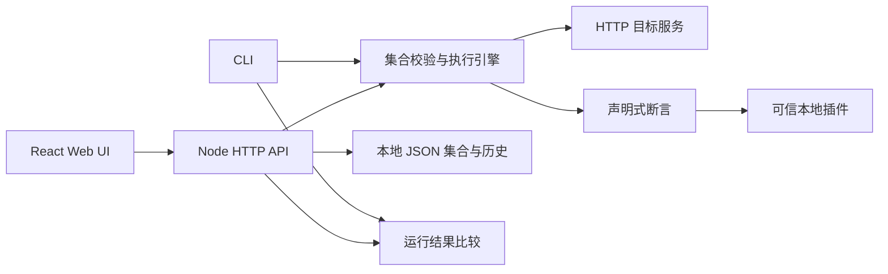

# 架构与约束

RequestDock 使用 TypeScript / Node.js 提供请求执行与 HTTP 服务，React / Vite 提供浏览器 UI。`src/shared/types.ts` 定义集合、断言、运行结果和插件接口；CLI 和 HTTP 路由调用同一核心实现。

## 数据流

1. CLI 读取集合文件，或 API 接收编辑/导入的集合；先校验格式。
2. 执行时合并集合变量和运行时覆盖值，解析 `{{variable}}`，发送请求。
3. 捕获响应或可解释的失败，依次执行内置及已加载插件断言。
4. 生成共享 `RunResult`；CLI 可导出 JSON，Web 服务保存历史供 UI 查看。
5. 按请求 id 比较状态码、请求执行错误和解析后的 JSON body（非 JSON 则比较文本），输出增加、删除和变化路径。忽略规则相对于 body；运行时间戳、耗时、headers 和检查消息不参与比较。

## 文件与持久化

源码文件按 CLI 入口、核心逻辑、HTTP 服务与存储、共享类型、React UI 分工。生产构建输出 `dist`，其中 `dist/ui` 为静态前端，`dist/cli.js` 为 Node 入口。

集合包含 `version: 1`、名称、字符串变量和请求数组。每个请求有稳定 `id`，用于结果关联。运行结果同时记录状态、耗时、响应头、文本 body、检查结果和错误。文件格式是可审查数据，不执行导入的脚本。

服务数据目录默认 `.requestdock`，可用 `--data` 或 `REQUESTDOCK_DATA` 配置，包含 `collections` 和 `runs` 子目录。保存使用临时文件再 rename，Web 历史同时受 20 次和 64 MiB 磁盘 JSON 字节预算限制，按时间倒序保留能放入预算的连续最新记录。同时间按 ID 倒序排序。运行报告以紧凑 JSON 保存；进程内只索引 ID、时间和字节数，保存时不重新解析全部正文。读取与清理使用同一队列，启动按文件大小检查后逐个重建索引。它面向单进程、单用户；本版不提供跨进程锁、共享存储并发协调或多副本部署保证。

## API 的职责

| 路由 | 用途 |
| --- | --- |
| `GET /api/health` | 无需 token 的进程健康检查 |
| `GET /api/demo`、`POST /api/demo` | 固定合成响应，便于本地演示 |
| `GET /api/info` | 版本与已加载插件 |
| `GET /api/collections`、`POST /api/collections` | 集合列表、新建 |
| `PUT /api/collections/:id`、`DELETE /api/collections/:id` | 更新、删除 |
| `POST /api/run` | `{ collection, variables?, requestId? }` |
| `GET /api/history` | 运行历史 |
| `POST /api/compare` | `{ baseline, current, ignorePaths? }` |
| `POST /api/import` | 接收原生 RequestDock 或 Postman JSON，返回集合与 warnings，不自动执行 |

请求/响应字段以 [server.ts](../src/server.ts) 与共享类型为准；当前 API 是 `0.x` 内部接口，不能视作已承诺长期兼容的公共平台。

API JSON 输入上限 4 MiB，最多同时运行 4 个集合。每个集合顺序请求，单个响应读取上限 2 MiB。CLI/Web 的单次完整序列化运行报告上限为 16 MiB：包含元数据、脱敏后的响应和所有未执行请求的占位信息；越界项清空正文及响应头、明确失败，后续请求不再发送并标为 Not sent。历史读取最多装入受 64 MiB 磁盘预算限制的 JSON，反序列化仍会占用额外内存。大文件和负载测试不在本版目标内。

前端与 API 生产环境由同一服务提供。开发期 Vite 把 `/api` 转发到本地后端。修改代理或部署域名时必须同时验证 Origin 检查和 token 传递。

## 安全边界

本地工作台需要访问本地和内网 API，因此不是默认屏蔽内网的公网抓取服务。token 持有者能使用服务进程的网络权限。非 loopback 监听需要 token，浏览器请求接受同源检查；部署者仍需约束网络、文件权限及反向代理。插件与主进程同权限，数据目录没有加密，秘密脱敏只有启发式覆盖。[完整边界](../SECURITY.md)

## 设计取舍

- 声明式断言容易评审，代价是暂不兼容 Postman 的任意 JavaScript 脚本。
- JSON 易于 Git diff 与程序生成；复杂编辑体验放在 UI，避免创造新的集合语言。
- 一个执行引擎减少 CLI/Web 差异；浏览器不直接绕过 CORS 访问远程 API。
- 本地存储降低初次运行成本；分布式并发和团队协作不在 MVP 承诺内。
- 不把“离线、Git、CLI”宣传成首创；项目价值需要真实迁移和回归体验验证。
